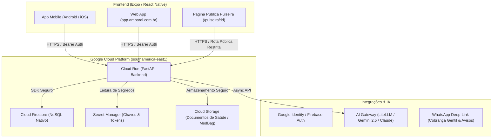

# Amparai — Sistema Operacional do Cuidado Familiar

[](https://github.com/joaoschaun33-cloud/Amparai/actions/workflows/ci.yml)
[](https://fastapi.tiangolo.com)
[](https://expo.dev)
[](https://cloud.google.com)
[](#privacidade-segurança-e-lgpd)

> O Amparai transforma a família em um time coordenado de cuidado para pais e mães idosos.
> O idoso nunca opera o aplicativo — o Amparai é a sala de controle da família.

---

## 🧭 Visão do Produto

Quando um familiar abre o Amparai à noite, ele tem apenas uma pergunta na mente: *"Minha mãe está bem?"*.
A tela inicial responde em **3 segundos**, sem necessidade de toques adicionais ou navegações complexas.

### Princípios Invioláveis de Produto e Design
* **Calma por padrão:** Estado "tudo bem" em verde-oliva (`#5C6E49`). O vermelho (`#A9402E`) é reservado **exclusivamente** para o botão e fluxo de emergência (SOS).
* **Voz de melhor amiga enfermeira:** Comunicação humana, calorosa e empática. Nunca utilizamos termos clínicos ou de vigilância (proibido: *"paciente"*, *"monitorar"*, *"vigiar"*, *"rastrear"*, *"ALERTA"* ou diagnósticos médicos diretos).
* **Emergência a um toque:** Botão SOS permanente e central, com acionamento para contatos da família, histórico recente e discagem direta para o 192 (SAMU).
* **LGPD & Segurança por Design:** Dados de saúde são estritamente isolados e nunca trafegam em rotas públicas não autenticadas ([D-004](DECISOES.md)). A pulseira de emergência expõe unicamente o primeiro nome, foto e contatos para socorro.

---

## 🏛️ Arquitetura do Sistema



### Módulos Principais
1. **Hoje:** Resumo do dia em tom calmo, checklist de primeiros passos, checagem de medicações e observações contextuais de IA.
2. **Escala de Plantão:** Organização de turnos entre irmãos e cuidadores, com detecção e aviso de lacunas de cuidado sem fricção emocional.
3. **Círculo de Cuidado:** Gestão de papéis da família (*Coordenador*, *Familiar*, *Cuidador*, *Profissional*), convites por token forte com expiração e RBAC rígido.
4. **Pasta de Saúde (MedBag):** Registro seguro e unificado de receitas, exames e dados clínicos ([D-008](DECISOES.md) / [D-009](DECISOES.md)), estruturado em compatibilidade com o padrão **FHIR**.
5. **Divisão de Custos:** Registro de despesas com OCR inteligente de comprovantes e lembretes gentis por WhatsApp.
6. **Central de Emergência (SOS) & Pulseira:** Fluxo de apoio imediato e leitura pública minimizada para localização rápida do idoso em situações de perambulação.

---

## 🛠️ Stack Tecnológica

| Camada | Tecnologia | Detalhes |
|---|---|---|
| **Mobile & Web** | React Native, Expo SDK 52, TypeScript | Plataforma única para Android, iOS e Web PWA |
| **Backend API** | Python 3.11, FastAPI, Pydantic v2 | Alta performance assíncrona, validação rigorosa de schemas |
| **Banco de Dados** | Google Cloud Firestore | NoSQL escalável com regras granulares de segurança |
| **Infraestrutura** | GCP Cloud Run, Firebase Hosting | Deploy serverless na região `southamerica-east1` (São Paulo) |
| **IA & LLMs** | LiteLLM Proxy, Gemini Flash / Claude Sonnet | Resumo semanal empático e OCR de recibos com salvaguarda |
| **CI/CD** | GitHub Actions | 3 gates de validação obrigatórios (Frontend, Backend Unit/Security, Firestore Emulator Integration) |

---

## 🚀 Como Executar Localmente

### Pré-requisitos
* **Node.js**: v20+ e npm
* **Python**: v3.11+
* **Java JDK**: 21+ (necessário para o Firestore Emulator)
* **Docker** (opcional, para build de contêiner)

### 1. Clonar o Repositório
```bash
git clone https://github.com/joaoschaun33-cloud/Amparai.git
cd Amparai
```

### 2. Configurar o Backend
```bash
cd backend
python -m venv .venv
# No Windows:
.venv\Scripts\activate
# No Linux/macOS:
source .venv/bin/activate

pip install -r requirements.txt
```

### 3. Configurar o Frontend
```bash
cd ../frontend
npm install
```

### 4. Executar em Modo Staging Local (Isolado e Gratuito)
Utilizamos o **Firestore Emulator** para garantir que testes locais nunca toquem em dados de produção:

```bash
# Terminal 1: Iniciar Emulador do Firestore
npx firebase-tools emulators:start --only firestore --project demo-amparai

# Terminal 2: Iniciar Backend conectado ao Emulador
$env:AMPARAI_TEST_MODE="1"
$env:FIRESTORE_EMULATOR_HOST="127.0.0.1:8080"
$env:GOOGLE_CLOUD_PROJECT="demo-amparai"
uvicorn server:app --reload --port 8000

# Terminal 3: Iniciar Frontend (Web / Metro)
cd frontend
npm run start
```

Consulte o [`GUIA_STAGING.md`](GUIA_STAGING.md) para detalhes completos do ambiente de desenvolvimento.

---

## 🧪 Qualidade, Segurança e Testes

O repositório adota política de **Dogma Zero**: nenhuma alteração é considerada pronta sem comprovação automatizada.

### Execução dos Testes Automatizados

#### 1. Invariantes de Segurança
```bash
python scripts/security_checks.py
```

#### 2. Testes Unitários do Backend
```bash
# No Windows PowerShell:
$env:PYTHONPATH="backend"
pytest backend/tests_unit -q

# No Linux/macOS:
PYTHONPATH=backend pytest backend/tests_unit -q
```

#### 3. Testes de Integração Backend (com Firestore Emulator)
```bash
bash scripts/run_backend_integration.sh
```

#### 4. Verificação Estática de Tipos e Linting (Frontend)
```bash
cd frontend
npx tsc --noEmit
npm run lint
```

---

## 🔒 Privacidade, Segurança e LGPD

1. **Minimização de Dados (Art. 6º, III, LGPD):** Coletamos apenas os dados estritamente necessários para viabilizar o cuidado familiar.
2. **Consentimento Explícito (Art. 7º, I e Art. 11, I):** Termo de consentimento versionado, com auditoria imutável (IP, timestamp, agente) e declaração formal de cuidador de fato.
3. **Isolamento de Credenciais:** Nenhuma chave de API ou segredo de serviço é comitado no repositório. Ambientes de produção utilizam Google Secret Manager e Identity Federation.
4. **Proteção da Pulseira Pública ([D-004](DECISOES.md)):** Rotas públicas não expõem histórico clínico, doenças, alergias ou notas médicas — exibem apenas canais de socorro imediato.

---

## 📚 Documentação e Decisões de Engenharia

* [`DECISOES.md`](DECISOES.md) — Registro oficial de decisões de produto e arquitetura (D-001 a D-009).
* [`DECISOES_TECNICAS.md`](DECISOES_TECNICAS.md) — Histórico técnico, decisões de infraestrutura e escolhas de engenharia.
* [`PENDENCIAS.md`](PENDENCIAS.md) — Roadmap vivo, tarefas pendentes e blockers de release.
* [`memory/PRD.md`](memory/PRD.md) — Especificação de produto do MVP.
* [`LGPD_INVENTARIO_DADOS.md`](LGPD_INVENTARIO_DADOS.md) — Inventário completo de dados e bases legais.
* [`AGENTS.md`](AGENTS.md) — Regras mandatórias para agentes e desenvolvedores que atuam no repositório.

---

## 📄 Licença
Propriedade de Amparai Tecnologia — Todos os direitos reservados.
